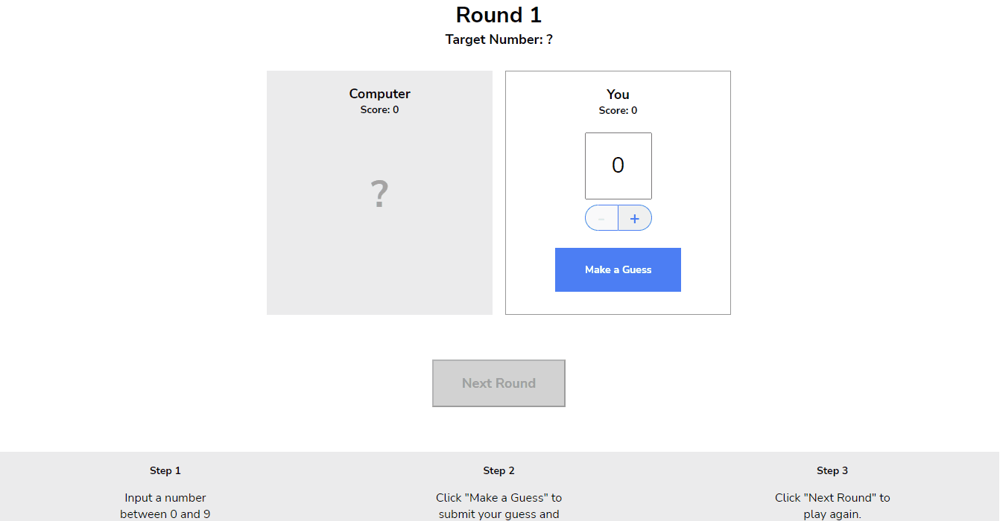

# Number Guesser
JavaScript funtions to power a small guessing game

## <a href="https://daryldelrosario.github.io/number-guesser">Live Demo</a>
<kbd></kbd>

## Features
* Input validation for user guess
* Error message if user guess is anything other than numbers 0 - 9
* User guess appears in the input box card
